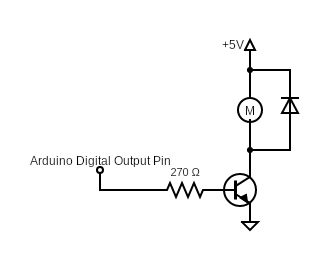
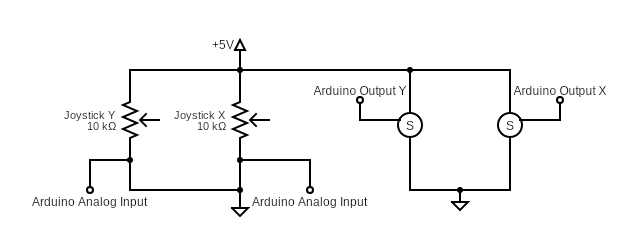
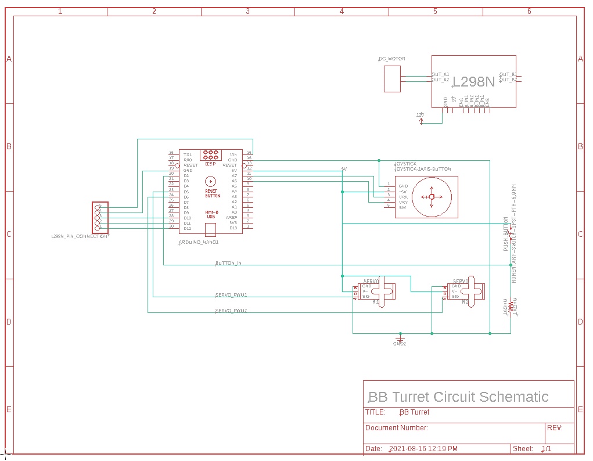

# Arduino-BB-Turret
## About
The BB Turret is a project developed for [Zen Maker Lab](https://www.zenmakerlab.com/).

The code found under [BB_Turret](https://github.com/hhenry01/Arduino-BB-Turret/blob/main/BB_Turret/BB_Turret.ino) controls the shooting and aiming functions of the turret. The two other folders separate the shooting and aiming funciontalities.

## How it Works
Full details surrounding the project belong to Zen Maker Lab. This README only describes the code and the circuit.
### Shooting

When a button is pressed, the Arduino outputs a voltage to the transistor's base. With a resistor, this creates a current which supplies the motor. The diode is to prevent damage to the motor. The motor pulls a launcher using a gear, like a rack and pinion. The gear does not have teeth along its entire circumference, and so automatically releases the launcher forward. When it is released it hits a BB shooting it.

### Aiming

To aim the turret, a joystick controls the two servo motors. Since servos need specific angles, inputs must be processed. Smooth motion is created by taking the input and resizing it within an acceptable range for speed. Within that range lies different degrees of speed, simulating analog output, which is more intuitive and allows for finer control.\
\
The button in a joystick is not used because a dedicated button is preferable to control the DC motor. Using the joystick button makes it difficult to keep steady and hard to press when holding a direction. With a dedicated button, one can comfortably shoot the turret no matter the situation.\
\
Finally, at the end of the loop, a 10 ms delay is necessary. Without it, any input via the analog stick would cause immediately rotate the servos to their limits.

#### Full Circuit Schematic
