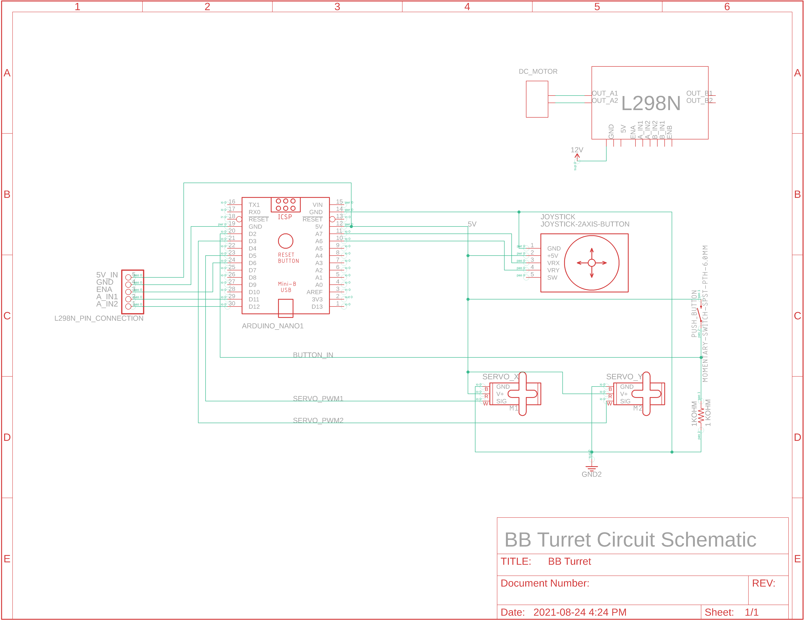

# Arduino-BB-Turret
## About
The BB Turret is a project developed for [Zen Maker Lab](https://www.zenmakerlab.com/).

The code found under [BB_Turret](https://github.com/hhenry01/Arduino-BB-Turret/blob/main/BB_Turret/BB_Turret.ino) controls the shooting and aiming functions of the turret.

## How it Works
Full details surrounding the project belong to Zen Maker Lab. This README only describes the code and the circuit.
### Shooting

When a button is pressed, the Arduino outputs two voltages to the L298N module in order to spin a motor. One of the input pins is set to *HIGH* while the other is set to *LOW*. For more information, see an [L298N schematic](https://www.handsontec.com/dataspecs/L298N%20Motor%20Driver.pdf).\
\
The motor spins a gear in a rack and pinion system. The gear pushes the rack against a spring. The gear does not have teeth around its entire circumference, so the rack is eventually released and is propelled forward by a spring, hitting and shooting a projectile.

### Aiming

To aim the turret, a joystick controls the two servo motors. Since servos need specific angles, inputs must be processed. Smooth motion is created by taking the input and resizing it within an acceptable range for speed. Within that range lies different degrees of speed, simulating analog output, which is more intuitive and allows for finer control.\
\
The button in a joystick is not used because a dedicated button is preferable to control the DC motor. Using the joystick button makes it difficult to keep steady and hard to press when holding a direction. With a dedicated button, one can comfortably shoot the turret no matter the situation.\
\
Finally, at the end of the loop, a 10 ms delay is necessary. Without it, any input via the analog stick would cause immediately rotate the servos to their limits.

#### Full Circuit Schematic and Board
\
\
\
The PCB has a ground plane that connects all ground pins to each other.